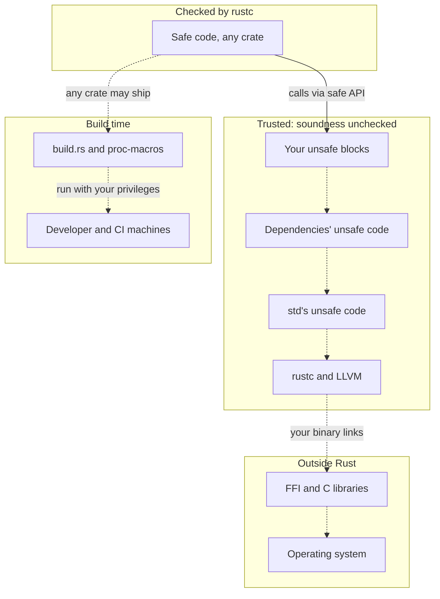
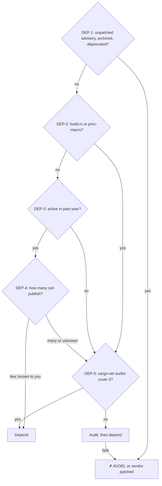
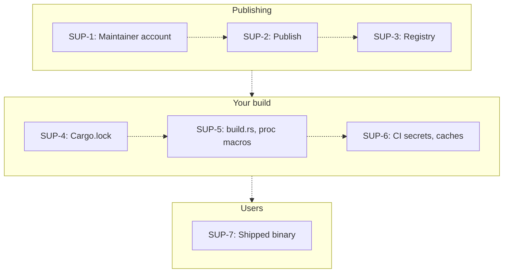

# Rust for Security and Privacy Researchers

Where Rust's safety guarantees stop, and how to secure Rust code, dependencies, builds and services. [CI](.github/workflows/check.yml) compiles every Rust example below.

Last verified 2026-10-05 · Rust 1.99 · edition 2024

| Job | Go to | First action |
|---|---|---|
| Know what Rust prevents | [Guarantees](#what-rust-does-and-doesnt-protect) | Plan for panics, overflow, logic bugs ([LIM-2](#lim-2)–[LIM-4](#lim-4)) |
| Vet a dependency | [Dependencies](#is-this-crate-safe-to-depend-on) | Check its crates.io Security tab ([DEP-1](#dep-1)) |
| Secure builds, releases, incident response | [Supply chain](#supply-chain-releases-response) | Commit `Cargo.lock` ([SUP-4](#sup-4)); advisory: [SUP-8](#sup-8) |
| Write or audit `unsafe`, FFI (foreign-code calls) | [Unsafe](#unsafe-and-ffi) | Check each `// SAFETY:` against the callee's `# Safety` docs ([UNS-4](#uns-4)) |
| Share data across threads or tasks | [Concurrency](#concurrency-and-async) | `thread::scope` or `Arc<Mutex<T>>` ([CON-1](#con-1)) |
| Audit unfamiliar code | [Auditing](#auditing-rust-code) | Open it only where no credentials live ([AUD-9](#aud-9), [AUD-10](#aud-10)) |
| Choose crypto, TLS, secret storage | [Crypto](#crypto-tls-secrets) | rustls ≥0.23.45 ([CRY-1](#cry-1)) |
| Harden a network service | [Services](#hardening-a-service) | Time out slow clients ([SVC-1](#svc-1)) |
| Pick a bug-finding tool | [Tools](#which-tool-finds-which-bug) | Run tests reaching `unsafe` under Miri (undefined-behavior detector) ([TOOL-1](#tool-1)) |
| Harden or sandbox a binary | [Hardening](#binary-hardening-and-sandboxing) | Release overflow checks ([HARD-1](#hard-1)) |
| Embedded, kernel, Wasm, safety-critical | [Domains](#domains-embedded-kernel-wasm-safety-critical) | Guard firmware stacks ([DOM-1](#dom-1)) |
| Zero-knowledge (ZK) proofs, threshold signing, FHE (encrypted computation) | [Privacy tech](#privacy-tech) | Test that circuits reject tampered values ([PRIV-1](#priv-1)) |
| Learn from past incidents | [Casebook](#casebook) | Update Rust promptly ([CASE-1](#case-1)) |
| Fix code from this guide's 2024 version | [Corrections](#corrected-since-the-2024-version) | Apply each row's fix |
| Report or follow vulnerabilities | [Stay current](#stay-current) | Toolchain: security@rust-lang.org; crates: [SUP-9](#sup-9) |

## If you do only ten things

1. Commit `Cargo.lock` and build with `--locked` ([SUP-4](#sup-4)).
2. Fail CI on RustSec advisories ([DEP-1](#dep-1)) and update Rust promptly ([CASE-1](#case-1)).
3. Build or open untrusted code only where no credentials live ([SUP-5](#sup-5)).
4. Never `unwrap` or `expect` input or config ([LIM-2](#lim-2)).
5. Give each `unsafe` block a `// SAFETY:` proof ([UNS-4](#uns-4)) and run its tests under Miri ([TOOL-1](#tool-1)).
6. Use rustls ≥0.23.45 and never disable certificate checks ([CRY-1](#cry-1)).
7. Load secrets from a secret store (a file your orchestrator mounts, or a secrets manager) into `SecretString` ([CRY-9](#cry-9)).
8. Bound every request's time and size ([SVC-1](#svc-1), [SVC-4](#svc-4)).
9. Fuzz every parser of untrusted input ([TOOL-3](#tool-3)).
10. Use the lints and release profile of this repository's `snippets` crate ([UNS-1](#uns-1), [TOOL-4](#tool-4), [HARD-1](#hard-1)):

```toml
# Workspace: put all of this in the root Cargo.toml, the lints as [workspace.lints.rust] and
# [workspace.lints.clippy], then add [lints] workspace = true to every member, root included.
[lints.rust]
unsafe_code = "forbid" # UNS-1. Crates that need unsafe: "deny", then #[allow] per module

[lints.clippy] # Opt-in restriction lints (TOOL-4); justify each #[expect(lint, reason = "...")]
# Only Clippy checks these, so run `cargo clippy --all-targets --locked` in CI. For tests, set
# allow-unwrap-in-tests, allow-expect-in-tests, allow-indexing-slicing-in-tests in clippy.toml
# Existing code: start indexing_slicing, arithmetic_side_effects at "warn"; #![deny] per module
unwrap_used = "deny"                # LIM-2
expect_used = "deny"                # LIM-2
indexing_slicing = "deny"           # LIM-2
arithmetic_side_effects = "deny"    # LIM-3
as_conversions = "deny"             # AUD-3
undocumented_unsafe_blocks = "deny" # UNS-4

[profile.release]
# HARD-1: overflow panics instead of wrapping, in dependencies too
# (`as` casts still truncate silently)
overflow-checks = true
# HARD-2: the default; with "abort", any panic ends the whole process
# and catch_unwind cannot stop it. A panic while holding a std Mutex
# poisons it: handle PoisonError instead of unwrapping lock().
panic = "unwind"
# HARD-3: strip removes symbol names but is no meaningful security measure (rustc docs), and
# "symbols" can garble backtraces: drop it if you need crash reports. Panic messages keep
# source paths, so remap them in CI release builds (the last matching prefix wins; add one
# for a CARGO_HOME outside HOME). RUSTFLAGS replaces every rustflags setting in
# .cargo/config.toml; if you have any, add the flag there with an absolute path instead:
# RUSTFLAGS="--remap-path-prefix=$HOME=~" cargo build --release --locked
strip = "symbols"
```

## Corrected since the 2024 version

| Old advice | Risk | Fix |
|---|---|---|
| "Pin dependencies" with `=` | Blocks semver-compatible fixes | Commit `Cargo.lock`, build `--locked` ([SUP-4](#sup-4)) |
| Token from `OsRng` and `% len`, then printed | Breaks on rand ≥0.9; biased; leaked | `getrandom::fill` ([CRY-6](#cry-6)) |
| Secrets in env vars; default database fallback; URL printed | Fails open; leaks credentials | Secret store; fail closed ([CRY-9](#cry-9)) |
| rustls `with_safe_defaults` and `webpki` | Pre-0.22 API; verifier [idle since 2024-02](https://github.com/briansmith/webpki/commits/main) | rustls ≥0.23.45, platform verifier ([CRY-1](#cry-1)) |
| "Implement secure communication protocols" like TLS, SSH | Home-made protocol bugs | rustls, russh or snow ([Crypto](#crypto-tls-secrets)) |
| JWT with a hard-coded key, no backend, no iss/aud check, token printed | Forgery; panics; leaked tokens | [CRY-2](#cry-2) |
| "type safety extend to FFI boundaries"; bindgen run from `main`; `to_str().unwrap()` on C strings | Unchecked signatures; panics; wrong-allocator frees | [UNS-10](#uns-10), [UNS-12](#uns-12) |
| Raw pointers via `&num`, then `&mut num` | `&mut` invalidates the first (Miri, [Stacked Borrows](https://github.com/rust-lang/unsafe-code-guidelines/blob/master/wip/stacked-borrows.md)) | `&raw const`, `&raw mut` ([UNS-5](#uns-5)) |
| "Arc is both Send and Sync"; threads never joined | Unsound sharing; lost work | [CON-1](#con-1) |
| Redaction credited to "move semantics" | Secret never wiped | `SecretString` ([CRY-9](#cry-9)) |
| thiserror `{0}` in client errors | Leaks internals | [SVC-14](#svc-14) |
| Rust's types "prevent common web vulnerabilities" like XSS | Unescaped output | [Autoescaping templates](https://askama.rs/en/stable/filters.html#safe), [DOM-3](#dom-3) |
| rust-analyzer for "vulnerability detection" | Runs untrusted build code; finds no vulnerabilities | [AUD-9](#aud-9) |
| `cargo audit` for crypto misuse; RustCrypto "audits and formal verification" | False assurance | Check audit scope ([Crypto](#crypto-tls-secrets)) |
| Groth16 with a single-party setup; Paillier as MPC; GG18/GG20 code | Forged proofs; key extraction | [PRIV-2](#priv-2), [PRIV-5](#priv-5) |
| PQClean for post-quantum | Archived | [CRY-8](#cry-8) |
| Fuzzing `std` parsing | Tests std, not your code | [TOOL-3](#tool-3) |
| Prusti as the leading verifier | Last release 2024-03 | [TOOL-6](#tool-6), [TOOL-7](#tool-7) |
| A libssh2 authentication bypass Rust "would have prevented" | Overstates Rust | That was libssh [CVE-2018-10933](https://www.libssh.org/security/advisories/CVE-2018-10933.txt), a logic bug ([LIM-4](#lim-4)) |
| Firecracker's and Tock's isolation credited to Rust | Ignores other layers | KVM, seccomp, jailer ([Hardening](#binary-hardening-and-sandboxing)); MPU ([Domains](#domains-embedded-kernel-wasm-safety-critical)) |

## What Rust does and doesn't protect

Safe Rust (no `unsafe`) prevents memory corruption and data races: Android estimates, from one near-miss, [0.2 vs ~1,000](https://blog.google/security/rust-in-android-move-fast-fix-things/) memory-safety vulnerabilities per million lines, Rust vs C/C++. Go, Java and Python are [memory-safe too](https://www.cisa.gov/resources-tools/resources/memory-safe-languages-reducing-vulnerabilities-modern-software-development), but [racy Go can corrupt memory](https://go.dev/ref/mem). Both guarantees need sound rustc, std and `unsafe` (no undefined behavior), so safe Rust is no sandbox.

| Property | Holds only if | Real failure | Control |
|---|---|---|---|
| Memory and data-race safety | rustc, std and all `unsafe` are sound | [cve-rs](#case-cve-rs); [Linux Binder](#case-binder) | <a id="lim-1"></a>**LIM-1** Run untrusted Rust (plugins, generated code) as Wasm ([HARD-5](#hard-5)) or in a separate OS-sandboxed process ([HARD-4](#hard-4)) |
| No crash, leak, deadlock | never: `unwrap`, `expect`, `[i]` panic; safe Rust allows [leaks](https://doc.rust-lang.org/book/ch15-06-reference-cycles.html), deadlocks | [Cloudflare outage](#case-cloudflare) | <a id="lim-2"></a>**LIM-2** Never `unwrap` or `expect` input or config; [CON-3](#con-3) |
| No integer overflow | never: release [wraps](https://doc.rust-lang.org/cargo/reference/profiles.html#overflow-checks) | [Tock kernel crash](#case-ticktock) | <a id="lim-3"></a>**LIM-3** Use `checked_*` arithmetic on input sizes ([HARD-1](#hard-1)) |
| Correct logic | never | [sudo-rs authentication bypass](#case-sudo-auth) | <a id="lim-4"></a>**LIM-4** Test that authentication rejects bad cases |
| No TOCTOU (check-then-use race) | never | [std](#case-std-toctou), [uutils](#case-uutils), [sudo-rs](#case-sudoedit) | [CON-6](#con-6) |
| Constant time | never: LLVM may add branches | [curve25519-dalek](#case-dalek) | [CRY-5](#cry-5), [CRY-7](#cry-7) |
| Safe builds | every build.rs, proc-macro is benign | [arrayref](#case-arrayref) | [SUP-5](#sup-5) |

**Legend.** Boundary diagrams: subgraph = trust zone; solid arrow = compiler-checked (types only); dashed = trusted, unchecked. Decision diagram: diamond = question; rectangle = action; arrow label = answer; `✗ AVOID` = stop.

Unlabeled arrows mean "relies on": rustc can't verify `unsafe` promises; any crate's build code runs on your machines.



**Go deeper**
- [Behavior not considered unsafe](https://doc.rust-lang.org/reference/behavior-not-considered-unsafe.html): use for the full list.

## Is this crate safe to depend on?

A dependency's build script (`build.rs`) and procedural macros (compile-time functions) run arbitrary code when you build ([Cargo](https://blog.rust-lang.org/2022/09/14/cargo-cves/), [Reference](https://doc.rust-lang.org/reference/procedural-macros.html)), and the toolchain [trusts them fully](https://rust-lang.org/policies/security/). Vet new crates before their first build:



- <a id="dep-1"></a>**DEP-1** Before adding a crate, confirm its exact name ([typosquats](https://rustsec.org/advisories/RUSTSEC-2025-0155.html)), then check its crates.io [Security tab](https://blog.rust-lang.org/2026/01/21/crates-io-development-update/#security-tab) for unpatched advisories. After, `cargo deny check advisories` ([0.20.2](https://crates.io/crates/cargo-deny/0.20.2), 2026-07-09) fails on vulnerable or unmaintained crates; add [`unsound = "all"`](https://embarkstudios.github.io/cargo-deny/checks/advisories/cfg.html#unsound) for transitive unsoundness. RustSec misses some repository-only advisories ([cap-std](https://github.com/sunfishcode/cap-std/security/advisories/GHSA-hp8f-xmx4-4qrg)). Archived or `x.y.z+deprecated` also means avoid: RustSec has [no unmaintained advisory](https://rustsec.org/packages/serde_yaml.html) for archived [serde_yaml](https://github.com/dtolnay/serde-yaml).
- <a id="dep-2"></a>**DEP-2** Audit uncovered build-time code in the crates.io [Code tab](https://blog.rust-lang.org/2026/07/13/crates-io-development-update/), which shows what Cargo downloads, not the repository. Stop rust-analyzer first; it [runs that code](https://rust-analyzer.github.io/book/security.html).
- <a id="dep-3"></a>**DEP-3** Activity is the later of the last release and default-branch commit.
- <a id="dep-4"></a>**DEP-4** `cargo supply-chain publishers` ([0.3.7](https://crates.io/crates/cargo-supply-chain/0.3.7), 2026-02-05) lists who can publish your dependencies; any can ship malware.
- <a id="dep-5"></a>**DEP-5** Run cargo-vet ([0.10.2](https://crates.io/crates/cargo-vet/0.10.2), 2026-01-13) in CI so new crates and versions fail until audited. Imports are [not transitive](https://mozilla.github.io/cargo-vet/importing-audits.html); Google calls its audits [best-effort](https://github.com/google/rust-crate-audits#disclaimer). Vendor a patched copy via [`[patch]`](https://doc.rust-lang.org/cargo/reference/overriding-dependencies.html).

```bash
cargo install --locked cargo-deny@0.20.2 cargo-supply-chain@0.3.7 cargo-vet@0.10.2
cargo vet init              # once per project
cargo vet import google
cargo vet import mozilla
gh api repos/OWNER/REPO/security-advisories --jq '.[] | .ghsa_id + " " + .summary' # DEP-1
gh api repos/OWNER/REPO --jq .archived # DEP-1: true means avoid
cargo add CRATE             # stop rust-analyzer first (DEP-2)
cargo deny check advisories # DEP-1
cargo metadata --locked --format-version 1 | jq -r '.packages[]
  | select(any(.targets[].kind[]; . == "custom-build" or . == "proc-macro"))
  | "\(.name) \(.version)"'  # DEP-2
gh api 'repos/OWNER/REPO/commits?per_page=1' --jq '.[0].commit.committer.date' # DEP-3
cargo supply-chain publishers # DEP-4
cargo vet trust CRATE PUBLISHER # DEP-4: only for few, known publishers
cargo vet                   # DEP-5: lists what still needs an audit
```

**Go deeper**
- [cargo-vet book](https://mozilla.github.io/cargo-vet/): use for criteria and `cargo vet trust`.
- [Trail of Bits](https://appsec.guide/docs/languages/rust/supply-chain-analysis/): use for cargo-crev and cackle.

## Supply chain, releases, response

Attacks enter at every stage. Commit `Cargo.lock`, isolate secrets, publish without stored tokens, update for advisories, report privately.



| Stage | Control | Tool |
|---|---|---|
| Maintainer account ([phishing](#case-phishing)) | <a id="sup-1"></a>**SUP-1** Sign in only via typed or bookmarked URLs ([2025-09-12](https://blog.rust-lang.org/2025/09/12/crates-io-phishing-campaign/)); schedule calls yourself; never run what callers send ([2026-09-17](https://blog.rust-lang.org/2026/09/17/targeted-attacks/)). | [Passkeys](https://docs.github.com/en/authentication/authenticating-with-a-passkey/about-passkeys) |
| Publish | <a id="sup-2"></a>**SUP-2** Use Trusted Publishing ([30-minute](https://crates.io/docs/trusted-publishing) CI tokens), then disable token publishing ([2026-01-21](https://blog.rust-lang.org/2026/01/21/crates-io-development-update/)). | [crates-io-auth-action v1.0.5](https://github.com/rust-lang/crates-io-auth-action/releases/tag/v1.0.5) |
| Registry ([tar](#case-tar)) | <a id="sup-3"></a>**SUP-3** Run Rust ≥[1.96.1](https://blog.rust-lang.org/2026/06/30/Rust-1.96.1/) (Cargo's SSH-library CVEs). Check advisories daily ([malware too](https://blog.rust-lang.org/2026/02/13/crates.io-malicious-crate-update/)). | [DEP-1](#dep-1), [OSS Rebuild](https://github.com/google/oss-rebuild) |
| Cargo.lock ([arrayref](#case-arrayref)) | <a id="sup-4"></a>**SUP-4** Commit `Cargo.lock`; build, install `--locked`; keep caret requirements, not `=` pins ([Cargo](https://doc.rust-lang.org/cargo/reference/specifying-dependencies.html)). | Dependabot ([3-day](https://docs.github.com/en/code-security/dependabot/working-with-dependabot/dependabot-options-reference#cooldown-) cooldown) or Renovate [`minimumReleaseAge`](https://docs.renovatebot.com/configuration-options/#minimumreleaseage) |
| build.rs, proc macros ([proc-macro1](#case-arrayref)) | <a id="sup-5"></a>**SUP-5** Building or opening a repo runs its code; hold no credentials there. | Container or VM |
| CI secrets, caches ([Miri](#case-miri)) | <a id="sup-6"></a>**SUP-6** No secrets in jobs that write caches PRs can read ([2026-09-21](https://blog.rust-lang.org/2026/09/21/github-actions-leaking-secrets-when-miri-output-is-cached/)). | GitHub environments, [zizmor 1.30.1](https://github.com/zizmorcore/zizmor/releases/tag/v1.30.1) |
| Shipped binary | <a id="sup-7"></a>**SUP-7** Use `cargo auditable build`; attach an SBOM (dependency list), provenance (signed build record). | [cargo-auditable 0.7.7](https://crates.io/crates/cargo-auditable/0.7.7), [cargo-cyclonedx 0.5.9](https://crates.io/crates/cargo-cyclonedx/0.5.9), [actions/attest v4.2.2](https://github.com/actions/attest/releases/tag/v4.2.2) |

**Respond:**
- <a id="sup-8"></a>**SUP-8** Advisory in your tree: `cargo update <crate>`; if a parent blocks it (`cargo tree -i <crate>`), upgrade the parent or [`[patch]`](https://doc.rust-lang.org/cargo/reference/overriding-dependencies.html) a fixed fork. Malware: wipe build machines; rotate secrets from clean ones ([2022-05-10](https://blog.rust-lang.org/2022/05/10/malicious-crate-rustdecimal/)).
- <a id="sup-9"></a>**SUP-9** Toolchain or crates.io bug: security@rust-lang.org ([policy](https://rust-lang.org/policies/security/)). Crate bug: owners privately, then GitHub and [RustSec](https://github.com/rustsec/advisory-db/blob/main/CONTRIBUTING.md) advisories. Malware: help@crates.io ([policy](https://crates.io/policies/security)).
- <a id="sup-10"></a>**SUP-10** Your crate: revoke leaked credentials first; ship semver-compatible fixes, then advisories; yanks miss lockfiles ([Cargo](https://doc.rust-lang.org/cargo/commands/cargo-yank.html)).
- <a id="sup-11"></a>**SUP-11** [Manufacturer selling in the EU](https://digital-strategy.ec.europa.eu/en/policies/cyber-resilience-act): since 2026-09-11, report actively exploited vulnerabilities, severe incidents via [CRA's Single Reporting Platform](https://digital-strategy.ec.europa.eu/en/policies/cra-reporting): 24 h early warning, 72 h notification.

[SUP-2](#sup-2) on GitHub:

```yaml
# .github/workflows/release.yml. Trusted Publishing needs the crate on crates.io already: publish
# the first version with an API token scoped to publish-new and this crate, with an expiry; then
# register this file name and the "release" environment on crates.io and disable token publishing.
on: { push: { tags: ["v*"] } }
permissions: {}
jobs:
  verify: # builds the crate, so dependency build scripts run here, without credentials
    runs-on: ubuntu-latest
    permissions: { contents: read }
    steps:
      - uses: actions/checkout@3d3c42e5aac5ba805825da76410c181273ba90b1 # v7.0.1
        with: { persist-credentials: false }
      - run: cargo package --locked
  publish: # any step here can mint an OIDC token, so build nothing (--no-verify) and restore no caches
    needs: verify
    runs-on: ubuntu-latest
    environment: release # in repo settings: require a reviewer, allow only v* tags
    permissions: { contents: read, id-token: write }
    steps:
      - uses: actions/checkout@3d3c42e5aac5ba805825da76410c181273ba90b1 # v7.0.1
        with: { persist-credentials: false }
      - uses: rust-lang/crates-io-auth-action@c6f97d42243bad5fab37ca0427f495c86d5b1a18 # v1.0.5
        id: auth
      - run: cargo publish --locked --no-verify
        env: { CARGO_REGISTRY_TOKEN: "${{ steps.auth.outputs.token }}" }
```

**Go deeper**
- [crates.io Trusted Publishing](https://crates.io/docs/trusted-publishing): use for setup, GitLab.
- [GitHub Actions secure use](https://docs.github.com/en/actions/reference/security/secure-use): use for hardening workflows.

## Unsafe and FFI

`unsafe` and FFI rest on promises the compiler [can't check](https://doc.rust-lang.org/book/ch20-01-unsafe-rust.html); breaking one is undefined behavior (UB) program-wide.

| Check | Enforce with |
|---|---|
| <a id="uns-1"></a>**UNS-1** Forbid `unsafe` where unneeded; dependencies and [their macros' `unsafe`](https://github.com/rust-lang/rust/blob/1.99.0/compiler/rustc_middle/src/lint.rs#L440-L475) aren't covered. | `[lints.rust] unsafe_code = "forbid"` ([Cargo ≥1.74](https://doc.rust-lang.org/cargo/reference/manifest.html#the-lints-section)) |
| <a id="uns-2"></a>**UNS-2** Edition 2024 makes [`env::set_var`/`remove_var`](https://doc.rust-lang.org/std/env/fn.set_var.html) [unsafe](https://doc.rust-lang.org/edition-guide/rust-2024/newly-unsafe-functions.html): call them in non-async `main` before spawning threads. | `edition = "2024"` ([Rust ≥1.85](https://blog.rust-lang.org/2025/02/20/Rust-1.85.0/)) |
| <a id="uns-3"></a>**UNS-3** Prefer safe APIs: derived casts over [`transmute`](https://doc.rust-lang.org/std/mem/fn.transmute.html). | [zerocopy 0.8.59](https://docs.rs/zerocopy/0.8.59/zerocopy/), [bytemuck 1.25.2](https://docs.rs/bytemuck/1.25.2/bytemuck/) |
| <a id="uns-4"></a>**UNS-4** Give each block one unsafe operation and a `// SAFETY:` proof of every `# Safety` precondition, valid while other threads run. | Clippy `undocumented_unsafe_blocks`, `multiple_unsafe_ops_per_block` |
| <a id="uns-5"></a>**UNS-5** Keep `unsafe` small, inside a safe wrapper sound for every input; use `&raw const`/`&raw mut`. | Clippy `borrow_as_ptr`; deny [`unsafe_op_in_unsafe_fn`](https://doc.rust-lang.org/edition-guide/rust-2024/unsafe-op-in-unsafe-fn.html) |
| <a id="uns-6"></a>**UNS-6** Check length math, [distrust safe traits](https://doc.rust-lang.org/nomicon/safe-unsafe-meaning.html), stay [panic-safe](https://doc.rust-lang.org/nomicon/exception-safety.html); `Drop` may [never run](https://doc.rust-lang.org/std/mem/fn.forget.html). | Clippy `arithmetic_side_effects`; [UNS-8](#uns-8) |
| <a id="uns-7"></a>**UNS-7** Bound [`unsafe impl Send`/`Sync`](https://doc.rust-lang.org/nomicon/send-and-sync.html) like std: `Box<T>` on `T: Send`/`Sync`; [`Arc<T>`](https://doc.rust-lang.org/std/sync/struct.Arc.html#impl-Send-for-Arc%3CT,+A%3E) on `T: Send + Sync`; [`Mutex<T>`](https://doc.rust-lang.org/std/sync/struct.Mutex.html#impl-Sync-for-Mutex%3CT%3E) on `T: Send`. | [AUD-1](#aud-1) |
| <a id="uns-8"></a>**UNS-8** Run every test reaching `unsafe` under Miri (AddressSanitizer for FFI); fuzz safe wrappers. | [TOOL-1](#tool-1), [TOOL-3](#tool-3) |
| <a id="uns-9"></a>**UNS-9** Model-check loop-bounded unsafe functions; Kani misses aliasing. | [TOOL-6](#tool-6) |
| <a id="uns-10"></a>**UNS-10** Generate `unsafe extern` signatures; Rust trusts them unchecked. Take C enums, `bool`s as integers; [validate](https://anssi-fr.github.io/rust-guide/unsafe/ffi.html#robustness). | [bindgen 0.73.2](https://docs.rs/bindgen/0.73.2/bindgen/struct.Builder.html) in [build.rs](https://rust-lang.github.io/rust-bindgen/tutorial-3.html), allowlisted |
| <a id="uns-11"></a>**UNS-11** Catch panics before they reach C ([abort since 1.81](https://blog.rust-lang.org/2024/09/05/Rust-1.81.0/)). | [`catch_unwind`](https://doc.rust-lang.org/std/panic/fn.catch_unwind.html); `extern "C-unwind"` ([1.71](https://blog.rust-lang.org/2023/07/13/Rust-1.71.0/)) for intended unwinding |
| <a id="uns-12"></a>**UNS-12** Free memory with its allocator. | A `Drop` wrapper |

| Allocated by | Freed by | Rust type or API | Failure if wrong |
|---|---|---|---|
| Rust (`CString::into_raw`) | Rust | [`CString::from_raw`](https://doc.rust-lang.org/std/ffi/struct.CString.html#method.from_raw) | C `free()`: wrong allocator |
| Rust (`Box::into_raw`) | Rust, once | [`Box::from_raw`](https://doc.rust-lang.org/std/boxed/struct.Box.html#method.from_raw) | Double free |
| C, lent to you | C | [`CStr::from_ptr`](https://doc.rust-lang.org/std/ffi/struct.CStr.html#method.from_ptr), then copy | Use after free, double free |
| C, given to you | Its library's free | `Drop` wrapper | `CString::from_raw`/`Box::from_raw`: UB |

```rust no_run
use core::ffi::{CStr, c_char, c_int, c_void};

// Rust trusts these signatures unchecked: generate them from the header (UNS-10).
unsafe extern "C" {
    fn abs(x: c_int) -> c_int; // keep unsafe, never `safe fn`: abs(INT_MIN) is UB
    fn strdup(s: *const c_char) -> *mut c_char; // caller frees with free()
    fn free(p: *mut c_void);
}

fn main() {
    // SAFETY: -42 != c_int::MIN, so abs is defined.
    let y = unsafe { abs(-42) };
    // SAFETY: a c"..." literal is NUL-terminated and 'static.
    let p = unsafe { strdup(c"from C".as_ptr()) };
    if p.is_null() {
        return; // allocation failed
    }
    // SAFETY: p is non-null and NUL-terminated; we copy it out before free().
    let s = unsafe { CStr::from_ptr(p) }.to_string_lossy().into_owned(); // no unwrap
    // C allocated p, so C frees it. In a library, free in a Drop impl (UNS-12).
    // SAFETY: p came from strdup and is freed exactly once, here.
    unsafe { free(p.cast()) };
    println!("{y} {s}");
}
```

**Go deeper**
- [Rustonomicon](https://doc.rust-lang.org/nomicon/): use for aliasing rules.

## Concurrency and async

Safe Rust rejects data races (unsynchronized concurrent access, one writing) at compile time, not race conditions or deadlocks ([Nomicon](https://doc.rust-lang.org/nomicon/races.html)); `unsafe` races can corrupt memory. Async adds cancellation, unbounded queues, blocked executors.

| Need | Use | Avoid (failure) |
|---|---|---|
| <a id="con-1"></a>**CON-1** Cross-thread sharing | [`thread::scope`](https://doc.rust-lang.org/std/thread/fn.scope.html), or [`Arc`](https://doc.rust-lang.org/std/sync/struct.Arc.html) of a `Mutex`, `RwLock` or atomic (`Arc<T>: Send` needs `T: Send + Sync`) | Unconstrained `unsafe impl Send/Sync` ([UNS-7](#uns-7)) |
| <a id="con-2"></a>**CON-2** Panic while locked | Fail closed, or re-check invariants, then [`PoisonError::into_inner`](https://doc.rust-lang.org/std/sync/struct.Mutex.html#poisoning) | `.lock().unwrap()` in servers (panics cascade); [`tokio::sync::Mutex`](https://rfd.shared.oxide.computer/rfd/0400#no_mutex) (silently unlocks) |
| <a id="con-3"></a>**CON-3** Deadlocks | One lock order; drop std guards before [`.await`](https://docs.rs/tokio/1.53.2/tokio/sync/struct.Mutex.html#which-kind-of-mutex-should-you-use) ([`await_holding_lock`](https://rust-lang.github.io/rust-clippy/master/index.html#await_holding_lock)) | Relocking a held `Mutex` (hang/panic) |
| <a id="con-4"></a>**CON-4** Cancellation: `select!`, [`timeout`](https://docs.rs/tokio/1.53.2/tokio/time/fn.timeout.html), [client disconnects](https://rfd.shared.oxide.computer/rfd/0400#case_study_dropshot) drop futures | [`reserve()`, then `Permit::send`](https://docs.rs/tokio/1.53.2/tokio/sync/mpsc/struct.Sender.html#method.reserve) (tokio [≥1.53.2](https://github.com/tokio-rs/tokio/releases/tag/tokio-1.53.2); 1.51.x: [≥1.51.5](https://github.com/tokio-rs/tokio/releases/tag/tokio-1.51.5)) | `send`, `read_exact`, `write_all` (lost data) |
| <a id="con-5"></a>**CON-5** Bound queues, blocking | [`mpsc::channel(n)`](https://docs.rs/tokio/1.53.2/tokio/sync/mpsc/fn.channel.html) (threads: [`sync_channel(n)`](https://doc.rust-lang.org/std/sync/mpsc/fn.sync_channel.html)); [`Semaphore`](https://docs.rs/tokio/1.53.2/tokio/sync/struct.Semaphore.html)-capped [`spawn_blocking`](https://docs.rs/tokio/1.53.2/tokio/task/fn.spawn_blocking.html) | [`unbounded_channel`](https://docs.rs/tokio/1.53.2/tokio/sync/mpsc/fn.unbounded_channel.html), std [`channel`](https://doc.rust-lang.org/std/sync/mpsc/fn.channel.html) (unbounded memory); blocking in tasks (stall) |
| <a id="con-6"></a>**CON-6** File check-then-use (TOCTOU) | One opened handle (cap-std [≥4.0.3](#svc-9)) | Re-resolving the path ([symlink swap](#case-sudoedit)) |
| <a id="con-7"></a>**CON-7** Lock-dependent `unsafe` | `// SAFETY:` holds in all interleavings; loom, shuttle | Single-thread reasoning (memory corruption) |

```rust
use tokio::{sync::mpsc::{self, Sender}, time::{Duration, timeout}};

#[derive(Debug, PartialEq)]
enum Fwd { Full(String), Closed(String) } // either way, the caller still owns the message

// CON-4: reserve a slot before handing over `msg`, so a timeout can't lose it.
async fn forward(tx: &Sender<String>, msg: String) -> Result<(), Fwd> {
    match timeout(Duration::from_secs(1), tx.reserve()).await {
        Ok(Ok(permit)) => { permit.send(msg); Ok(()) }
        Ok(Err(_closed)) => Err(Fwd::Closed(msg)), // receiver gone for good: never retry
        Err(_elapsed) => Err(Fwd::Full(msg)),      // queue full: retry later or reject
    }
}

#[tokio::main(flavor = "current_thread")]
async fn main() {
    let (tx, mut rx) = mpsc::channel(1); // bounded: back-pressure, not memory growth
    assert_eq!(forward(&tx, "a".into()).await, Ok(()));
    assert_eq!(forward(&tx, "b".into()).await, Err(Fwd::Full("b".into()))); // "b" comes back
    assert_eq!(rx.recv().await.as_deref(), Some("a"));
    drop(rx); // consumer gone: fail at once instead of waiting out the timeout
    assert_eq!(forward(&tx, "c".into()).await, Err(Fwd::Closed("c".into())));
}
```

**Go deeper**
- [Oxide RFD 400](https://rfd.shared.oxide.computer/rfd/0400), [tokio `select!`](https://docs.rs/tokio/1.53.2/tokio/macro.select.html#cancellation-safety): use for cancel safety.
- [loom 0.7.2](https://docs.rs/loom/0.7.2/loom/) (exhaustive), [shuttle 0.9.5](https://docs.rs/shuttle/0.9.5/shuttle/) (randomized): use for [CON-7](#con-7).

## Auditing Rust code

Confirm grep hits in a [SUP-5](#sup-5) sandbox: Clippy, Miri, [CodeQL](https://docs.github.com/en/code-security/reference/code-scanning/codeql/build-options-for-compiled-languages#no-build-for-rust) and [rust-analyzer](https://github.com/rust-lang/rust-analyzer) (which finds no vulnerabilities) [run the repo's build scripts and proc macros](https://rust-analyzer.github.io/book/security.html). Rust ≥[1.97.0](https://blog.rust-lang.org/2026/07/09/Rust-1.97.0/) emits v0-mangled symbols (`_R`-prefixed names); check reversing tools support them.

| Grep for | Bug class | Fix or confirm |
|---|---|---|
| <a id="aud-1"></a>**AUD-1** `unsafe impl` `Send`/`Sync` | [Bounds looser than std's](https://github.com/sslab-gatech/Rudra): data races | Match std's bounds ([UNS-7](#uns-7)); Clippy [`non_send_fields_in_send_ty`](https://rust-lang.github.io/rust-clippy/stable/index.html#non_send_fields_in_send_ty) (opt-in) |
| <a id="aud-2"></a>**AUD-2** `set_len` | [Uninitialized memory](https://doc.rust-lang.org/std/vec/struct.Vec.html#method.set_len) | Miri; Clippy [`uninit_vec`](https://rust-lang.github.io/rust-clippy/stable/index.html#uninit_vec) |
| <a id="aud-3"></a>**AUD-3** `as u8`, `as usize` | [Silent truncation](https://doc.rust-lang.org/reference/expressions/operator-expr.html#numeric-cast), NaN → 0 | `try_from` (floats: `(lo..=hi).contains(&x)`); Clippy [`as_conversions`](https://rust-lang.github.io/rust-clippy/stable/index.html#as_conversions) (opt-in) |
| <a id="aud-4"></a>**AUD-4** `AssertSqlSafe`, `QueryBuilder`, `"SELECT…{x}"` | SQL injection: [unchecked string](https://docs.rs/sqlx/0.9.0/sqlx/trait.SqlSafeStr.html), [unsanitized `push`](https://docs.rs/sqlx/0.9.0/sqlx/struct.QueryBuilder.html) | `.bind()`, `.push_bind()`; CodeQL [`rust/sql-injection`](https://codeql.github.com/codeql-query-help/rust/rust-sql-injection/) |
| <a id="aud-5"></a>**AUD-5** `danger` (reqwest, rustls verifiers) | TLS verification off ([reqwest](https://docs.rs/reqwest/0.13.5/reqwest/struct.ClientBuilder.html), [rustls](https://docs.rs/rustls/0.23.45/rustls/client/danger/index.html)): interception | Delete |
| <a id="aud-6"></a>**AUD-6** [`permissive`](https://docs.rs/actix-cors/0.7.2/actix_cors/struct.Cors.html#method.permissive), [`AllowOrigin::mirror_request`](https://docs.rs/tower-http/0.7.1/tower_http/cors/struct.AllowOrigin.html#method.mirror_request) | CORS: [any origin, with credentials](https://docs.rs/tower-http/0.7.1/tower_http/cors/struct.CorsLayer.html#method.very_permissive) | List allowed origins |
| <a id="aud-7"></a>**AUD-7** `derive(Debug)` on secrets | Secrets in logs | [`secrecy::SecretBox`](https://docs.rs/crate/secrecy/0.10.3/source/src/lib.rs); CodeQL [`rust/cleartext-logging`](https://codeql.github.com/codeql-query-help/rust/rust-cleartext-logging/) |
| <a id="aud-8"></a>**AUD-8** `==` on MAC tags | Timing leak | [CRY-5](#cry-5) |
| <a id="aud-9"></a>**AUD-9** `build.rs`, `proc-macro` | [Build-time code execution](https://doc.rust-lang.org/reference/procedural-macros.html), dependencies' too | Read first; VS Code [Restricted Mode](https://github.com/rust-lang/rust-analyzer/blob/master/editors/code/package.json) (no rust-analyzer) or a VM |
| <a id="aud-10"></a>**AUD-10** `.cargo/config*`, `rust-toolchain*` | [Any program as `rustc`](https://rust-analyzer.github.io/book/security.html) on most `cargo` commands, including rust-analyzer's; [`runner`](https://doc.rust-lang.org/cargo/reference/config.html#targettriplerunner) on `run`/`test`/`bench` | Read first; run [`cargo audit --file <checkout>/Cargo.lock`](https://github.com/rustsec/rustsec/blob/main/cargo-audit/README.md) outside the checkout, so neither file loads |

```bash
# grep and find only read files; nothing here runs the repo's code
REPO=path/to/untrusted/checkout
grep -rniE --include='*.rs' \
  -e 'unsafe impl.*(Send|Sync)' -e 'set_len' -e ' as [iu](8|16|32|64|128|size)' \
  -e 'AssertSqlSafe|QueryBuilder' -e '" *(select|insert|update|delete|where|order by) [^"]*[{]' \
  -e 'danger|permissive' -e 'AllowOrigin::mirror_request|allow_any_origin' \
  -e 'derive\(.*debug|^ *debug,' -e '(mac|tag)[^;]*==|==[^;]*(mac|tag)' "$REPO"
grep -rnE --include=Cargo.toml '^ *(build|proc[-_]macro) *=' "$REPO"
find "$REPO" -name build.rs -o -name 'rust-toolchain*' -o -path '*/.cargo/config*' -o -path '*/.vscode/*'
```

**Go deeper**
- [CodeQL Rust queries](https://codeql.github.com/codeql-query-help/rust/): use for taint tracking.
- [ANSSI guidelines](https://anssi-fr.github.io/rust-guide/): use for rule-by-rule review.
- [Check Point's Akira teardown](https://research.checkpoint.com/2024/inside-akira-ransomwares-rust-experiment/): use for reversing Rust malware.

## Crypto, TLS, secrets

Never hand-roll TLS, SSH or Noise: use rustls, [russh ≥0.64.1](https://github.com/Eugeny/russh/security/advisories) or [snow ≥0.9.5](https://rustsec.org/advisories/RUSTSEC-2024-0011.html).

| Job | Use (minimum version) | Avoid (why) | Status 2026-10-05 |
|---|---|---|---|
| <a id="cry-1"></a>**CRY-1** TLS | [rustls ≥0.23.45](https://rustsec.org/advisories/RUSTSEC-2026-0285.html), [default aws-lc-rs](https://github.com/rustls/rustls/blob/v/0.23.45/rustls/Cargo.toml) ([X25519MLKEM768 first](https://github.com/rustls/rustls/blob/v/0.23.45/rustls/src/crypto/aws_lc_rs/mod.rs)); [rustls-platform-verifier](https://github.com/rustls/rustls-platform-verifier/blob/v/0.7.1/README.md) (no revocation on Linux) | `webpki` ([idle since 2024-02](https://github.com/briansmith/webpki/commits/main); use [rustls-webpki ≥0.103.13](https://rustsec.org/advisories/RUSTSEC-2026-0104.html)); [`*danger_accept_invalid*`](https://docs.rs/reqwest/0.13.5/reqwest/struct.ClientBuilder.html); `ring` with `aws_lc_rs`, or neither, without `install_default()` ([`builder()` panics](https://github.com/rustls/rustls/blob/v/0.23.45/rustls/src/crypto/mod.rs)) | [0.23.45](https://crates.io/crates/rustls/0.23.45), 2026-09-14 |
| <a id="cry-2"></a>**CRY-2** JWT | [jsonwebtoken ≥10.3.0](https://github.com/advisories/GHSA-h395-gr6q-cpjc), `features = ["aws_lc_rs"]`, [≥256-bit key](https://www.rfc-editor.org/rfc/rfc7518.html#section-3.2), require iss, aud; asymmetric signing if others verify ([RFC 9068](https://www.rfc-editor.org/rfc/rfc9068.html#section-2.1)) | No backend feature ([panics](https://github.com/Keats/jsonwebtoken/blob/v11.1.0/src/crypto/mod.rs)); `rust_crypto` ([pulls `rsa`](https://github.com/Keats/jsonwebtoken/blob/v11.1.0/Cargo.toml)) | [11.1.0](https://crates.io/crates/jsonwebtoken/11.1.0), 2026-09-16 |
| <a id="cry-3"></a>**CRY-3** Passwords | [argon2 ≥0.6.0](https://github.com/RustCrypto/password-hashes/blob/argon2-v0.6.0/argon2/CHANGELOG.md#060-2026-08-27) `Argon2::default()` (Argon2id at [OWASP's minimum](https://cheatsheetseries.owasp.org/cheatsheets/Password_Storage_Cheat_Sheet.html)) | [Fast hashes](https://cheatsheetseries.owasp.org/cheatsheets/Password_Storage_Cheat_Sheet.html) like SHA-256 | [0.6.0](https://crates.io/crates/argon2/0.6.0), 2026-08-27 |
| <a id="cry-4"></a>**CRY-4** Encryption | [aes-gcm ≥0.10.3](https://rustsec.org/advisories/RUSTSEC-2023-0096.html) or chacha20poly1305; random 96-bit nonces ≤[2^32 messages per key](https://docs.rs/aead/0.6.1/aead/type.Nonce.html), else counter or XChaCha20Poly1305 | Reused nonce ([catastrophic](https://docs.rs/aead/0.6.1/aead/type.Nonce.html)); [sodiumoxide](https://rustsec.org/advisories/RUSTSEC-2021-0137.html) (deprecated) | [NCC-audited 2020](https://github.com/RustCrypto/AEADs/blob/master/aes-gcm/README.md) |
| <a id="cry-5"></a>**CRY-5** MAC check | [hmac](https://github.com/RustCrypto/MACs/blob/master/hmac/README.md) [`verify_slice`](https://docs.rs/digest/0.11.3/digest/trait.Mac.html) or [subtle](https://crates.io/crates/subtle/2.6.1) `ct_eq` | `==` on tags (timing leak) | [hmac 0.13.0](https://crates.io/crates/hmac/0.13.0), 2026-03-29 |
| <a id="cry-6"></a>**CRY-6** Tokens, keys | [`getrandom::fill`](https://github.com/rust-random/getrandom/blob/master/CHANGELOG.md) (Wasm: [DOM-4](#dom-4)) | `rng % len` (biased); `OsRng`, `RngCore` ([renamed in rand 0.10](https://rust-random.github.io/book/update-0.10.html)) | [0.4.3](https://crates.io/crates/getrandom/0.4.3), 2026-06-17 |
| <a id="cry-7"></a>**CRY-7** Signatures | [ed25519-dalek ≥2.0](https://rustsec.org/advisories/RUSTSEC-2022-0093.html), [curve25519-dalek ≥4.1.3](https://rustsec.org/advisories/RUSTSEC-2024-0344.html); [k256 ≥0.13.2](https://github.com/RustCrypto/elliptic-curves/blob/k256/v0.14.0/k256/CHANGELOG.md#0132-2023-11-15); RSA: [aws-lc-rs](https://docs.rs/aws-lc-rs/1.18.1/aws_lc_rs/rsa/index.html) ([constant-time](https://github.com/aws/aws-lc/blob/v5.7.0/crypto/fipsmodule/rsa/rsa_impl.c#L553-L576)) | [`rsa`](https://rustsec.org/advisories/RUSTSEC-2023-0071.html) signing, decryption (Marvin timing attack, unpatched) | k256 [NCC-reviewed 2023-08](https://www.nccgroup.com/research/public-report-entropyrust-cryptography-review/) (pre-0.14); [p256](https://github.com/RustCrypto/elliptic-curves/blob/master/p256/README.md), [ecdsa](https://github.com/RustCrypto/signatures/blob/master/ecdsa/README.md) unaudited |
| <a id="cry-8"></a>**CRY-8** Post-quantum | [CRY-1](#cry-1) for TLS; [aws-lc-rs](https://docs.rs/aws-lc-rs/1.18.1/aws_lc_rs/kem/index.html) ([aws-lc-sys ≥0.39.0](https://rustsec.org/advisories/RUSTSEC-2026-0044.html)), [libcrux-ml-kem](https://github.com/celabshq/libcrux/blob/main/libcrux-ml-kem/README.md) [≥0.0.10](https://docs.rs/crate/libcrux-ml-kem/0.0.10/source/Cargo.toml) ([RUSTSEC-2026-0212](https://rustsec.org/advisories/RUSTSEC-2026-0212.html)) or ml-kem | [pqcrypto, PQClean](https://rustsec.org/advisories/RUSTSEC-2026-0164.html) (archived); [pqc_kyber](https://rustsec.org/advisories/RUSTSEC-2026-0289.html) (unpatched) | [ml-kem](https://github.com/RustCrypto/KEMs/blob/master/ml-kem/README.md), [ml-dsa](https://github.com/RustCrypto/signatures/blob/master/ml-dsa/README.md) unaudited; libcrux [pre-0.1, partly verified](https://github.com/celabshq/libcrux) |
| <a id="cry-9"></a>**CRY-9** Secrets | [secrecy 0.10.3](https://crates.io/crates/secrecy/0.10.3) `SecretString` from a secret store (wiped on drop, redacted `Debug`); exit if missing or empty | `Debug` redaction alone (no wipe); [dotenv](https://rustsec.org/advisories/RUSTSEC-2021-0141.html) (dotenvy, dev-only); env vars (leak to [children](https://doc.rust-lang.org/std/process/struct.Command.html), [`/proc`](https://man7.org/linux/man-pages/man5/proc_pid_environ.5.html), [core dumps](https://man7.org/linux/man-pages/man5/core.5.html)) | [Best-effort wipe](https://docs.rs/zeroize/1.9.0/zeroize/#stackheap-zeroing-notes): moved or reallocated copies remain |
| <a id="cry-10"></a>**CRY-10** Hashing, key derivation | [sha2](https://docs.rs/sha2/0.11.0/sha2/), [blake3](https://docs.rs/blake3/1.8.7/blake3/); [hkdf](https://docs.rs/hkdf/0.13.0/hkdf/) | [MD5](https://www.rfc-editor.org/rfc/rfc6151.html), [SHA-1](https://www.nist.gov/news-events/news/2022/12/nist-retires-sha-1-cryptographic-algorithm) (collisions) | sha2 [0.11.0](https://crates.io/crates/sha2/0.11.0), 2026-03-25 |

```rust
use jsonwebtoken::{Algorithm, DecodingKey, EncodingKey, Header, Validation, decode, encode};
use serde::{Deserialize, Serialize};
const ISS: &str = "https://auth.example.com";
const AUD: &str = "orders-api";

#[derive(Serialize, Deserialize)]
struct Claims { sub: String, iss: String, aud: String, exp: u64 }

fn validation() -> Validation { // CRY-2: require every claim you check
    let mut v = Validation::new(Algorithm::HS256); // pinned; HS256 only if this service also signs
    v.set_issuer(&[ISS]);
    v.set_audience(&[AUD]);
    v.set_required_spec_claims(&["exp", "iss", "aud"]); // else tokens without iss/aud pass
    v
}

fn main() -> Result<(), Box<dyn std::error::Error>> {
    let mut key = [0u8; 32]; // 256-bit demo key; in production, load it from a secret store
    getrandom::fill(&mut key)?;
    let exp = jsonwebtoken::get_current_timestamp().saturating_add(300);
    let claims = Claims { sub: "user-1".into(), iss: ISS.into(), aud: AUD.into(), exp };
    let token = encode(&Header::new(Algorithm::HS256), &claims, &EncodingKey::from_secret(&key))?;
    decode::<Claims>(&token, &DecodingKey::from_secret(&key), &validation())?; // never log `token`
    Ok(())
}
```

**Go deeper**
- [rustls manual](https://docs.rs/rustls/0.23.45/rustls/manual/index.html): use for providers, FIPS.
- [OWASP Secrets Management](https://cheatsheetseries.owasp.org/cheatsheets/Secrets_Management_Cheat_Sheet.html): use for key storage, rotation.
- [Testing Handbook](https://appsec.guide/docs/crypto/): use for Wycheproof, constant-time tests.

## Hardening a service

Bound every input's time, size, nesting, file access.

| Need | Use (minimum version) | Avoid (why) | Status 2026-10-05 |
|---|---|---|---|
| <a id="svc-1"></a>**SVC-1** Slow clients (slowloris) | HTTP/1 [`header_read_timeout`](https://docs.rs/hyper/1.11.1/hyper/server/conn/http1/struct.Builder.html#method.header_read_timeout), [`timer`](https://docs.rs/hyper/1.11.1/hyper/server/conn/http1/struct.Builder.html#method.timer) (below; [axum](https://github.com/tokio-rs/axum/tree/axum-v0.8.9/examples/serve-with-hyper)); HTTP/2: cap [`max_concurrent_streams`](https://docs.rs/hyper/1.11.1/hyper/server/conn/http2/struct.Builder.html#method.max_concurrent_streams), proxy-enforced timeouts; [`TimeoutLayer::with_status_code`](https://docs.rs/tower-http/0.7.1/tower_http/timeout/struct.TimeoutLayer.html#method.with_status_code); [`Semaphore`](https://docs.rs/tokio/1.53.2/tokio/sync/struct.Semaphore.html#method.acquire_owned)-capped connections | [`axum::serve`](https://github.com/tokio-rs/axum/blob/axum-v0.8.9/axum/src/serve/mod.rs#L391), bare [HTTP/2](https://docs.rs/hyper/1.11.1/hyper/server/conn/http2/struct.Builder.html) (no header timeout) | hyper [1.11.1](https://crates.io/crates/hyper/1.11.1) |
| <a id="svc-2"></a>**SVC-2** HTTP/2 floods | h2 [≥0.4.16](https://rustsec.org/advisories/RUSTSEC-2026-0258.html) | 0.3.x ([unpatched](https://rustsec.org/advisories/RUSTSEC-2026-0258.html)); 0.4.0–0.4.3 ([CONTINUATION flood](https://rustsec.org/advisories/RUSTSEC-2024-0332.html)) | [0.4.19](https://crates.io/crates/h2/0.4.19) |
| <a id="svc-3"></a>**SVC-3** Cross-site forgery (CSRF) | tower-http [`CsrfLayer`](https://docs.rs/tower-http/0.7.1/tower_http/csrf/index.html); GET changes no state | [`very_permissive()`](https://docs.rs/tower-http/0.7.1/tower_http/cors/struct.CorsLayer.html#method.very_permissive) CORS ([AUD-6](#aud-6)) | [0.7.1](https://crates.io/crates/tower-http/0.7.1) |
| <a id="svc-4"></a>**SVC-4** Body, WebSocket size | [`RequestBodyLimitLayer`](https://docs.rs/tower-http/0.7.1/tower_http/limit/struct.RequestBodyLimitLayer.html); [`max_message_size`](https://docs.rs/axum/0.8.9/axum/extract/ws/struct.WebSocketUpgrade.html#method.max_message_size) <64 MB | [`DefaultBodyLimit`](https://docs.rs/axum/0.8.9/axum/extract/struct.DefaultBodyLimit.html) alone (skips streams), `disable()` | axum [0.8.9](https://crates.io/crates/axum/0.8.9) |
| <a id="svc-5"></a>**SVC-5** Length fields, decompression | Cap before allocating; [`take(cap+1)`](https://doc.rust-lang.org/std/io/trait.Read.html#method.take) on decoders, rejecting over `cap` bytes | [`with_capacity(wire_len)`](https://doc.rust-lang.org/std/vec/struct.Vec.html#method.with_capacity), unbounded decoders (OOM) | std |
| <a id="svc-6"></a>**SVC-6** Deserializing | [`serde(try_from)`](https://serde.rs/container-attrs.html#try_from) validation; depth limits ([serde_json: 128](https://docs.rs/crate/serde_json/1.0.151/source/src/de.rs#63)) | `derive(Deserialize)` alone (skips validation); [`disable_recursion_limit`](https://docs.rs/serde_json/1.0.151/serde_json/struct.Deserializer.html#method.disable_recursion_limit), recursive [postcard](https://github.com/jamesmunns/postcard/blob/postcard/v1.1.3/source/postcard/src/de/deserializer.rs) types (stack overflow) | serde_json [1.0.151](https://crates.io/crates/serde_json/1.0.151) |
| <a id="svc-7"></a>**SVC-7** Formats | JSON, TOML; [postcard](https://crates.io/crates/postcard) for binary | [serde_yaml](https://github.com/dtolnay/serde-yaml) (archived); [serde_yml](https://rustsec.org/advisories/RUSTSEC-2025-0068.html) (unsound); bincode ([unmaintained](https://rustsec.org/advisories/RUSTSEC-2025-0141.html), [unlimited](https://docs.rs/bincode/1.3.3/bincode/config/index.html)) | [1.1.3](https://crates.io/crates/postcard/1.1.3) |
| <a id="svc-8"></a>**SVC-8** SQL | sqlx [≥0.8.1](https://rustsec.org/advisories/RUSTSEC-2024-0363.html) `query!`, [`push_bind`](https://docs.rs/sqlx/0.9.0/sqlx/struct.QueryBuilder.html#method.push_bind) | [`push`](https://docs.rs/sqlx/0.9.0/sqlx/struct.QueryBuilder.html#method.push), [`AssertSqlSafe`](https://docs.rs/sqlx/0.9.0/sqlx/trait.SqlSafeStr.html) on input (injection; [AUD-4](#aud-4)) | [0.9.0](https://crates.io/crates/sqlx/0.9.0) |
| <a id="svc-9"></a>**SVC-9** User-named paths | [cap-std](https://github.com/sunfishcode/cap-std) [≥4.0.3](https://github.com/sunfishcode/cap-std/security/advisories/GHSA-hp8f-xmx4-4qrg) (3.x: ≥3.4.6) `Dir` ([CON-6](#con-6)) | [`base.join(input)`](https://doc.rust-lang.org/std/path/struct.Path.html#method.join) (`..` or absolute `input` escapes) | [4.0.3](https://crates.io/crates/cap-std/4.0.3) |
| <a id="svc-10"></a>**SVC-10** Archives (tar-slip, zip-slip) | tar [≥0.4.46](https://github.com/advisories/GHSA-3pv8-6f4r-ffg2) `unpack_in`; zip [≥2.3.0](https://github.com/advisories/GHSA-94vh-gphv-8pm8) [`extract`](https://docs.rs/zip/8.6.0/zip/read/struct.ZipArchive.html#method.extract) into empty directories | [`Entry::unpack`](https://docs.rs/tar/0.4.46/tar/struct.Entry.html#method.unpack) (escapes target); [`enclosed_name()`](https://docs.rs/zip/8.6.0/zip/read/struct.ZipFile.html#method.enclosed_name) alone (symlinks escape) | tar [0.4.46](https://crates.io/crates/tar/0.4.46), zip [8.6.0](https://crates.io/crates/zip/8.6.0) |
| <a id="svc-11"></a>**SVC-11** Child processes | Rust [≥1.81.0](https://blog.rust-lang.org/2024/09/04/cve-2024-43402/) ([`.bat` files](#case-bat)); allowlisted args; [`env_clear()`](https://doc.rust-lang.org/std/process/struct.Command.html#method.env_clear) | Untrusted args to `cmd.exe`, `sh -c`, [`raw_arg`](https://doc.rust-lang.org/std/process/struct.Command.html#method.arg); inherited env (leaks secrets) | std |
| <a id="svc-12"></a>**SVC-12** User URLs (SSRF) | [`timeout`](https://docs.rs/reqwest/0.13.5/reqwest/struct.ClientBuilder.html#method.timeout); [`Policy::none()`](https://docs.rs/reqwest/0.13.5/reqwest/redirect/struct.Policy.html#method.none); vet IP literals, [`dns_resolver`](https://docs.rs/reqwest/0.13.5/reqwest/struct.ClientBuilder.html#method.dns_resolver) results; [`no_proxy()`](https://docs.rs/reqwest/0.13.5/reqwest/struct.ClientBuilder.html#method.no_proxy); capped [`chunk()`](https://docs.rs/reqwest/0.13.5/reqwest/struct.Response.html#method.chunk) | [Defaults](https://docs.rs/reqwest/0.13.5/reqwest/redirect/index.html): no timeout, 10 redirects, system proxy | reqwest [0.13.5](https://crates.io/crates/reqwest/0.13.5) |
| <a id="svc-13"></a>**SVC-13** Logs (injection, leaks) | tracing-subscriber [≥0.3.20](https://rustsec.org/advisories/RUSTSEC-2025-0055.html) (escapes ANSI, [not newlines](https://github.com/tokio-rs/tracing/blob/tracing-subscriber-0.3.23/tracing-subscriber/src/fmt/format/escape.rs)); input as fields; [`instrument(skip_all)`](https://docs.rs/tracing/0.1.44/tracing/attr.instrument.html) | `%` (unescaped), messages with input (forged lines); bare `#[instrument]` (logs arguments) | [0.3.23](https://crates.io/crates/tracing-subscriber/0.3.23) |
| <a id="svc-14"></a>**SVC-14** Error responses | Generic message; log `source()` | [thiserror](https://docs.rs/thiserror/2.0.21/thiserror/) `{0}`, `transparent` (leak internals) | [2.0.21](https://crates.io/crates/thiserror/2.0.21) |

```rust no_run
use std::{convert::Infallible, io, sync::Arc, time::Duration};
use hyper::{Request, Response, body::Incoming, server::conn::http1, service::service_fn};
use hyper_util::rt::{TokioIo, TokioTimer};
// axum: copy only the Router-to-service_fn wiring from serve-with-hyper; keep this loop,
// since that example unwraps accept and binds 0.0.0.0. WebSockets need .with_upgrades().
async fn handle(_req: Request<Incoming>) -> Result<Response<String>, Infallible> {
    Ok(Response::new("ok".into()))
}
#[tokio::main(flavor = "current_thread")]
async fn main() -> io::Result<()> {
    let listener = tokio::net::TcpListener::bind("127.0.0.1:3000").await?;
    let slots = Arc::new(tokio::sync::Semaphore::new(1024)); // SVC-1: cap below the fd limit
    loop {
        let permit = slots.clone().acquire_owned().await.map_err(io::Error::other)?;
        let Ok((tcp, _)) = listener.accept().await else { // never unwrap (LIM-2): fds run out
            tokio::time::sleep(Duration::from_millis(100)).await; // back off, don't spin
            continue;
        };
        let conn = http1::Builder::new() // HTTP/1 only: HTTP/2 has no header timeout (SVC-1)
            .timer(TokioTimer::new()) // required: a timeout without a timer panics
            .header_read_timeout(Duration::from_secs(10)) // SVC-1: drop slowloris clients
            .serve_connection(TokioIo::new(tcp), service_fn(handle));
        tokio::spawn(async move { let _ = conn.await; drop(permit) }); // slot freed at close
    }
}
```

**Go deeper**
- [OWASP SSRF](https://cheatsheetseries.owasp.org/cheatsheets/Server_Side_Request_Forgery_Prevention_Cheat_Sheet.html): use for address checks.

## Which tool finds which bug

Match tool to bug class: Miri, sanitizers and fuzzers see only code that runs; Kani, only inputs its harness (test entry point) allows.

| Bug class | Catches it | Misses it | Cost |
|---|---|---|---|
| <a id="tool-1"></a>**TOOL-1** Undefined behavior (UB) in `unsafe` | [Miri](https://github.com/rust-lang/miri): `cargo +nightly miri test`; [AddressSanitizer (ASan)](https://doc.rust-lang.org/nightly/unstable-book/compiler-flags/sanitizer.html) (`-Zsanitizer=address`) for FFI | Untested paths; ASan: aliasing, some bugs in uninstrumented C | Nightly |
| <a id="tool-2"></a>**TOOL-2** Data races in `unsafe`; atomic-ordering bugs | [Miri](#tool-1); [ThreadSanitizer (TSan)](https://doc.rust-lang.org/nightly/unstable-book/compiler-flags/sanitizer.html): `RUSTFLAGS=-Zsanitizer=thread RUSTDOCFLAGS=-Zsanitizer=thread cargo +nightly test -Zbuild-std --target <triple>`; [loom](https://docs.rs/loom/0.7.2/loom/) (systematic) | Miri: unexplored interleavings; TSan: `atomic::fence`; loom: some relaxed orderings | TSan: nightly; loom: its types |
| <a id="tool-3"></a>**TOOL-3** Panics, wrong results on untrusted input | [cargo-fuzz](https://github.com/rust-fuzz/cargo-fuzz) plus an oracle (below) | Code the harness skips; unchecked output | Nightly; harness per parser |
| <a id="tool-4"></a>**TOOL-4** Panic and overflow sites; `unsafe` without `// SAFETY:` | [Clippy](https://rust-lang.github.io/rust-clippy/stable/index.html) `unwrap_used`, `indexing_slicing`, `arithmetic_side_effects`, `undocumented_unsafe_blocks` | Reachability; false SAFETY claims | Stable; opt-in |
| <a id="tool-5"></a>**TOOL-5** Injection (SQL, path, command, log) | [CodeQL](https://codeql.github.com/codeql-query-help/rust/), GA [2025-10-14](https://github.blog/changelog/2025-10-14-codeql-scanning-rust-and-c-c-without-builds-is-now-generally-available/) | Classes outside its queries | Private repos need [Code Security](https://docs.github.com/en/code-security/concepts/code-scanning/code-scanning) |
| <a id="tool-6"></a>**TOOL-6** Panic, overflow, out-of-bounds access, failed `assert!` (all inputs within bounds) | [Kani 0.68.0](https://github.com/model-checking/kani/releases/tag/kani-0.68.0) | [Aliasing, invalid values](https://model-checking.github.io/kani/undefined-behaviour.html), data races; inputs past [harness bounds](https://model-checking.github.io/kani/tutorial-loop-unwinding.html) | Harness per property |
| <a id="tool-7"></a>**TOOL-7** Spec violations | [Verus](https://github.com/verus-lang/verus), [Creusot](https://github.com/creusot-rs/creusot), [Aeneas](https://github.com/AeneasVerif/aeneas), [hax](https://github.com/cryspen/hax), [Flux](https://github.com/flux-rs/flux), all active 2026-10 | Wrong specs | Specs and proofs |
| Vulnerable, malicious dependencies | cargo-deny ([DEP-1](#dep-1)), cargo-vet ([DEP-5](#dep-5)) | Unreported or non-RustSec advisories; audit gaps | Stable; audits |

Avoid [Prusti](https://github.com/prusti/prusti) (no default-branch commit since 2024-03-26; pins nightly-2023-09-15), [Rudra](https://github.com/sslab-gatech/Rudra) and [MIRAI](https://github.com/facebookexperimental/MIRAI) (archived).

Fuzz your parser against an oracle (a correctness check):

```rust
// Setup: cargo install --locked cargo-fuzz@0.13.2 && cargo fuzz init
// In fuzz/fuzz_targets/fuzz_target_1.rs, make the target call the oracle:
//     fuzz_target!(|data: &[u8]| your_crate::check(data));
// Run: cargo +nightly fuzz run fuzz_target_1
use arbitrary::{Arbitrary, Unstructured};
#[derive(Arbitrary, Debug, PartialEq)]
pub struct Header { kind: u8, len: u16 }

pub fn encode(h: &Header) -> Vec<u8> {
    [&[h.kind][..], &h.len.to_be_bytes()].concat()
}

pub fn decode(bytes: &[u8]) -> Option<Header> {
    let &[kind, hi, lo] = bytes.first_chunk::<3>()?;
    Some(Header { kind, len: u16::from_be_bytes([hi, lo]) })
}

pub fn check(data: &[u8]) {
    let mut u = Unstructured::new(data);
    let Ok(header) = Header::arbitrary(&mut u) else { return };
    let _ = decode(u.take_rest()); // arbitrary bytes: may fail, must not panic
    assert_eq!(decode(&encode(&header)), Some(header)); // round-trip oracle
}

fn main() { check(&[1, 2, 3, 4]) } // smoke test; the fuzzer explores the rest
```

**Go deeper**
- [Fuzz Book](https://rust-fuzz.github.io/book/cargo-fuzz/structure-aware-fuzzing.html): use for `Arbitrary` inputs.
- [Testing Handbook](https://appsec.guide/docs/fuzzing/rust/cargo-fuzz/): use for fuzzing campaigns.

## Binary hardening and sandboxing

Linux x86-64 builds already get address randomization, non-executable data, read-only relocations and stack probes ([rustc](https://doc.rust-lang.org/rustc/exploit-mitigations.html)); stack protectors and control-flow integrity need nightly, except Windows' [`-C control-flow-guard`](https://doc.rust-lang.org/rustc/codegen-options/index.html#control-flow-guard). Set the [release profile](#if-you-do-only-ten-things) and confine the process: [Firecracker](https://github.com/firecracker-microvm/firecracker/blob/main/docs/design.md) pairs Rust with KVM, seccomp syscall filters and a jailer.

| Need | Use (minimum safe version) | Avoid (why) | Failure prevented | Status 2026-10-05 |
|---|---|---|---|---|
| <a id="hard-1"></a>**HARD-1** Overflow checks | [Release profile](#if-you-do-only-ten-things); `cargo test --release` | ring <0.17.12: [panics](https://rustsec.org/advisories/RUSTSEC-2025-0009.html) | Silent wraparound | [Default](https://doc.rust-lang.org/cargo/reference/profiles.html#overflow-checks) off |
| <a id="hard-2"></a>**HARD-2** Panic policy | Servers: `unwind`, [caught](https://doc.rust-lang.org/std/panic/fn.catch_unwind.html) per request; stack overflow, [OOM](https://doc.rust-lang.org/std/alloc/fn.handle_alloc_error.html) [still abort](https://github.com/rust-lang/rust/blob/1.99.0/library/std/src/sys/pal/unix/stack_overflow.rs#L83-L88) ([SVC-6](#svc-6)) | `abort` there: kills every request | Whole-service outage | [Default](https://doc.rust-lang.org/cargo/reference/profiles.html#panic) `unwind` |
| <a id="hard-3"></a>**HARD-3** Hide build paths | [`--remap-path-prefix`](https://doc.rust-lang.org/rustc/remap-source-paths.html) ([`RUSTFLAGS` overrides config](https://doc.rust-lang.org/cargo/reference/config.html#buildrustflags)) | Relying on [`strip`](https://doc.rust-lang.org/rustc/codegen-options/index.html#strip): panic messages keep paths | Leaked build paths | [`--remap-path-scope`](https://github.com/rust-lang/rust/pull/147611) stable 1.95; [`trim-paths`](https://github.com/rust-lang/cargo/pull/17488) unstable |
| <a id="hard-4"></a>**HARD-4** Least privilege | [landlock](https://github.com/landlock-lsm/rust-landlock) 0.4.7 (Linux ≥5.13), default-deny [seccompiler](https://docs.rs/seccompiler/0.5.0/seccompiler/) 0.5.0, before any [thread](https://docs.rs/landlock/0.4.7/landlock/#multithreaded-processes) or async runtime starts | Ignoring [`RulesetStatus`](https://docs.rs/landlock/0.4.7/landlock/enum.RulesetStatus.html): may enforce nothing | Post-exploit access | seccompiler [moved](https://github.com/rust-vmm/rust-vmm/tree/main/seccompiler) to rust-vmm |
| <a id="hard-5"></a>**HARD-5** Untrusted Wasm | wasmtime, wasmtime-wasi ≥[49.0.2](https://rustsec.org/advisories/RUSTSEC-2026-0327.html); fuel or epochs (CPU), [`StoreLimits`](https://docs.rs/wasmtime/49.0.2/wasmtime/struct.StoreLimitsBuilder.html) (memory) | Older: fuel [bypassable](https://github.com/bytecodealliance/wasmtime/security/advisories/GHSA-m63x-6p34-q65x); [CVE-2026-34971](https://github.com/advisories/GHSA-jhxm-h53p-jm7w) (aarch64), [CVE-2026-34987](https://github.com/advisories/GHSA-xx5w-cvp6-jv83) (Winch) escapes | Sandbox escape, resource exhaustion | Older lines: [48.0.4, 36.0.17](https://github.com/bytecodealliance/wasmtime/security/advisories/GHSA-j366-h8gg-77pm) |

**Go deeper**
- [Wasmtime security](https://docs.wasmtime.dev/security.html): use for defense layers.
- [Landlock crate](https://docs.rs/landlock/0.4.7/landlock/): use for fail-closed compatibility.

## Domains: embedded, kernel, Wasm, safety-critical

Plan for hazards Rust doesn't check: overflowing firmware stacks [overwrite statics](https://github.com/knurling-rs/flip-link#the-problem), Wasm linear memory lacks [internal guard pages and ASLR](https://www.usenix.org/system/files/sec20-lehmann.pdf), and [`set_inner_html`](https://docs.rs/web-sys/0.3.106/web_sys/struct.Element.html#method.set_inner_html) allows XSS. [Tock](https://github.com/tock/tock/blob/master/README.md) isolates apps with hardware, yet its kernel had [six isolation bugs Rust didn't catch](#case-ticktock). Run untrusted Wasm per [HARD-5](#hard-5).

| Need | Use (minimum safe version) | Avoid (why) | Failure prevented | Status 2026-10-05 |
|---|---|---|---|---|
| <a id="dom-1"></a>**DOM-1** Cortex-M stack | [flip-link](https://github.com/knurling-rs/flip-link#usage), or cortex-m-rt ≥0.7.6 [`set-msplim`](https://docs.rs/cortex-m-rt/0.7.7/cortex_m_rt/#set-msplim) (Armv8-M Mainline) | Default [layout](https://docs.rs/cortex-m-rt/0.7.7/cortex_m_rt/#_stack_start--_stack_end) (stack meets statics) | Silent corruption | [flip-link 0.1.12](https://crates.io/crates/flip-link/0.1.12), 2025-11-10 |
| <a id="dom-2"></a>**DOM-2** Linux kernel | Recheck `// SAFETY:` claims wherever locks drop | GCC-based builds ([experimental](https://github.com/torvalds/linux/commit/9fa7153c31a3)) | [Binder](#case-binder)-style races | Non-experimental since [7.0](https://github.com/torvalds/linux/commit/9fa7153c31a3) |
| <a id="dom-3"></a>**DOM-3** Wasm DOM output | [`set_text_content`](https://docs.rs/web-sys/0.3.106/web_sys/struct.Node.html#method.set_text_content); [ammonia ≥4.2.1](https://github.com/rust-ammonia/ammonia/blob/master/CHANGELOG.md#421) (4.1.x: ≥4.1.5) for user HTML | `set_inner_html` on input | XSS | [4.2.1](https://crates.io/crates/ammonia/4.2.1), 2026-10-03 |
| <a id="dom-4"></a>**DOM-4** `wasm32-unknown-unknown` randomness | [getrandom](https://github.com/rust-random/getrandom#webassembly-support) `wasm_js` in binaries | `wasm_js` in libraries (breaks non-Web builds) | Broken builds | [0.4.3](https://crates.io/crates/getrandom/0.4.3), 2026-06-17 |
| <a id="dom-5"></a>**DOM-5** Wasm allocator | Default | [wee_alloc](https://rustsec.org/advisories/RUSTSEC-2022-0054.html) (unmaintained) | Leaks | Last release [2019-08-22](https://crates.io/crates/wee_alloc/0.4.5) |
| <a id="dom-6"></a>**DOM-6** Certified products | [Ferrocene](https://ferrocene.dev/): "the first quality-managed, TÜV SÜD–qualified, open source Rust toolchain" ([ASIL D, SIL 3, Class C](https://ferrocene.dev/)); [Safety-Critical Rust Consortium](https://github.com/Safety-Critical-Rust-Consortium/safety-critical-rust-coding-guidelines) and [MISRA Rust addendum](https://misra.org.uk/app/uploads/2025/03/MISRA-C-2025-ADD6.pdf) rules | MISRA's safe-Rust ratings on `unsafe` code | Unchecked `unsafe`/FFI | [FLS](https://blog.rust-lang.org/2025/03/26/adopting-the-fls/) (language spec) adopted 2025-03-26; Consortium [draft 0.1.25](https://github.com/Safety-Critical-Rust-Consortium/safety-critical-rust-coding-guidelines/releases/tag/0.1.25) |

```rust no_run
// VULNERABLE (DOM-3): the browser parses `comment` as HTML, so `` runs script
fn show(el: &web_sys::Element, comment: &str) {
    el.set_inner_html(comment);
}

fn main() {
    let doc = web_sys::window().and_then(|w| w.document());
    if let Some(el) = doc.and_then(|d| d.get_element_by_id("comment")) {
        show(&el, "");
    }
}
```

```rust no_run
// FIXED (DOM-3): the browser shows `comment` as plain text and never parses it as HTML
fn show(el: &web_sys::Element, comment: &str) {
    el.set_text_content(Some(comment));
}

fn main() {
    let doc = web_sys::window().and_then(|w| w.document());
    if let Some(el) = doc.and_then(|d| d.get_element_by_id("comment")) {
        show(&el, "");
    }
}
```

**Go deeper**
- [Wasmtime security](https://docs.wasmtime.dev/security.html): use for sandbox guarantees.
- [Kernel Rust docs](https://docs.kernel.org/rust/index.html): use for coding rules.

## Privacy tech

ZK proofs, threshold signatures and homomorphic encryption mostly fail in maths Rust can't check. Paillier is encryption, not multi-party computation: protocols using it must [prove keys well formed](https://www.fireblocks.com/blog/gg18-and-gg20-paillier-key-vulnerability-technical-report).

| Need | Use (minimum safe version) | Avoid (why) | Prevents | Status |
|---|---|---|---|---|
| <a id="priv-1"></a>**PRIV-1** ZK circuit | [halo2_proofs](https://github.com/zcash/halo2); [MockProver](https://docs.rs/halo2_proofs/0.4.0/halo2_proofs/dev/struct.MockProver.html) rejecting tampered private cells | [Under-constrained](https://arxiv.org/abs/2402.15293) circuits (commonest); arkworks ([prototype](https://github.com/arkworks-rs/groth16)) | Forgery | [0.4.0](https://crates.io/crates/halo2_proofs/0.4.0), 2026-09-29 |
| <a id="priv-2"></a>**PRIV-2** Groth16 setup | [Per-circuit multi-party ceremony](https://docs.rs/phase2/0.2.2/phase2/) parameters | [`generate_random_parameters`](https://github.com/zkcrypto/bellman/blob/main/groth16/src/generator.rs) (caller keeps forging "toxic waste") | Forgery | [groth16 0.2.0](https://crates.io/crates/groth16/0.2.0), 2026-09-26 |
| <a id="priv-3"></a>**PRIV-3** Fiat-Shamir hash | Every public input and commitment | Partial transcripts ([Frozen Heart](https://blog.trailofbits.com/2022/04/13/part-1-coordinated-disclosure-of-vulnerabilities-affecting-girault-bulletproofs-and-plonk/)) | Forgery | [2022-04-13](https://blog.trailofbits.com/2022/04/13/part-1-coordinated-disclosure-of-vulnerabilities-affecting-girault-bulletproofs-and-plonk/) |
| <a id="priv-4"></a>**PRIV-4** zkVM (proven execution) | [risc0-zkvm ≥3.0.3](https://github.com/advisories/GHSA-jqq4-c7wq-36h7) (2.x: ≥2.3.2) | Old guest image IDs ([CVE-2025-61588](https://github.com/advisories/GHSA-jqq4-c7wq-36h7)); 2.0.0–2.0.2 ([CVE-2025-52484](https://github.com/advisories/GHSA-g3qg-6746-3mg9)) | Forgery | [3.0.6](https://crates.io/crates/risc0-zkvm/3.0.6), 2026-07-17 |
| <a id="priv-5"></a>**PRIV-5** Threshold ECDSA (t-of-n signing) | [`cggmp24 = "0.7.0-alpha.3"`](https://github.com/LFDT-Lockness/cggmp21) | Crate cggmp21 ([unpatched](https://rustsec.org/advisories/RUSTSEC-2025-0127.html)); GG18/GG20 code like ZenGo multi-party-ecdsa ([BitForge, CVE-2023-33241](https://www.fireblocks.com/blog/gg18-and-gg20-paillier-key-vulnerability-technical-report); [unmaintained](https://github.com/ZenGo-X/multi-party-ecdsa), RustSec silent) | [Key theft](https://rustsec.org/advisories/RUSTSEC-2025-0130.html) | [Pre-release](https://doc.rust-lang.org/cargo/reference/specifying-dependencies.html#pre-releases), [2025-12-04](https://crates.io/crates/cggmp24/0.7.0-alpha.3) |
| <a id="priv-6"></a>**PRIV-6** Threshold Schnorr | [ZcashFoundation/frost](https://github.com/ZcashFoundation/frost), `frost-<curve>` [≥2.2.0](https://github.com/advisories/GHSA-wgq8-vr6r-mqxm) ([RFC 9591](https://www.rfc-editor.org/info/rfc9591/)) | `frost-secp256k1-tr`, rerandomized FROST ([unaudited](https://github.com/ZcashFoundation/frost#ncc-audit)) | Weakened shares | [3.0.0](https://crates.io/crates/frost-ed25519/3.0.0), 2026-04-23 |
| <a id="priv-7"></a>**PRIV-7** FHE | [tfhe-rs](https://github.com/zama-ai/tfhe-rs) [≥1.1.0](https://github.com/zama-ai/tfhe-rs/releases/tag/tfhe-rs-1.1.0) defaults ([IND-CPA^D](https://github.com/zama-ai/tfhe-rs#security-model): share decryptions of honest results only) | IND-CPA parameters; [Concrete](https://github.com/zama-ai/concrete) (Python-first) | [Key recovery](https://doi.org/10.1145/3658644.3690341) | [1.8.1](https://crates.io/crates/tfhe/1.8.1), 2026-09-14; [no side-channel mitigation](https://github.com/zama-ai/tfhe-rs#side-channel-attacks): isolate client-key hosts; [commercial use: patent licence](https://github.com/zama-ai/tfhe-rs#license) |

**Go deeper**
- [Zebra](https://github.com/ZcashFoundation/zebra), [Zallet](https://github.com/zcash/zallet) (beta): use for Zcash ([zcashd halted 2026-07-18](https://zcash.github.io/zcash/user/end-of-life.html)).

## Casebook

Rust code has had memory corruption (`unsafe`, std, compiler) and logic, panic, timing, TOCTOU, supply-chain failures. Newest first.

| Disclosed | Event | Root cause | Control | Link |
|---|---|---|---|---|
| <a id="case-miri"></a>2026-09-21 | Cached Miri output exposed CI secrets | Env saved in `target/` | [SUP-6](#sup-6) | [blog](https://blog.rust-lang.org/2026/09/21/github-actions-leaking-secrets-when-miri-output-is-cached/) |
| 2026-09-17 | Video-call lures target crate owners | Social engineering | [SUP-1](#sup-1) | [blog](https://blog.rust-lang.org/2026/09/17/targeted-attacks/) |
| <a id="case-sudoedit"></a>2026-08-31 | sudo-rs `sudoedit` privilege escalation | Path resolved twice | [CON-6](#con-6) | [GHSA-f42v-x7gq-phc8](https://github.com/trifectatechfoundation/sudo-rs/security/advisories/GHSA-f42v-x7gq-phc8) |
| <a id="case-arrayref"></a>2026-08-20 | arrayref hijacked; `proc-macro1` build.rs fetched malware | Social engineering | [SUP-1](#sup-1), [SUP-4](#sup-4), [SUP-5](#sup-5) | [RUSTSEC-2026-0260](https://rustsec.org/advisories/RUSTSEC-2026-0260.html), [blog](https://blog.rust-lang.org/2026/08/20/supply-chain-attack-on-arrayref/), [2026-09-17](https://blog.rust-lang.org/2026/09/17/targeted-attacks/) |
| 2026-05-25 | Third-party registries: credential leak, cache overwrite | URL normalization; symlinks | [SUP-3](#sup-3) Rust ≥1.96.0 | [CVE-2026-5222](https://blog.rust-lang.org/2026/05/25/cve-2026-5222/), [CVE-2026-5223](https://blog.rust-lang.org/2026/05/25/cve-2026-5223/) |
| <a id="case-uutils"></a>2026-04-22 | uutils: 113 audit findings; Ubuntu kept GNU `cp`/`mv`/`rm` | Open TOCTOU bugs | [CON-6](#con-6) | [Canonical](https://discourse.ubuntu.com/t/an-update-on-rust-coreutils/80773) |
| <a id="case-tar"></a>2026-03-19 | Cargo's `tar` let crates chmod directories | Symlinks followed | [SUP-3](#sup-3) Rust ≥1.94.1; [SVC-10](#svc-10) | [CVE-2026-33056](https://blog.rust-lang.org/2026/03/21/cve-2026-33056/), [RUSTSEC-2026-0067](https://rustsec.org/advisories/RUSTSEC-2026-0067.html) |
| 2026-03-10 | `chrono_anchor` tried to exfiltrate `.env` files | Malicious crate | [CRY-9](#cry-9) | [RUSTSEC-2026-0039](https://rustsec.org/advisories/RUSTSEC-2026-0039.html) |
| <a id="case-binder"></a>2025-12-16 | Linux `rust_binder` corrupted kernel memory | Racy `SAFETY` claim | [CON-7](#con-7) | [CVE-2025-68260](https://www.cve.org/CVERecord?id=CVE-2025-68260) |
| <a id="case-cloudflare"></a>2025-11-18 | Cloudflare 5xx outage | `unwrap()` on oversized file | [LIM-2](#lim-2) | [Cloudflare](https://blog.cloudflare.com/18-november-2025-outage/) |
| <a id="case-sudo-auth"></a>2025-11-11 | sudo-rs skipped authentication; replayed typed passwords | Logic bugs | [LIM-4](#lim-4) | [CVE-2025-64517](https://github.com/trifectatechfoundation/sudo-rs/security/advisories/GHSA-q428-6v73-fc4q), [CVE-2025-64170](https://github.com/trifectatechfoundation/sudo-rs/security/advisories/GHSA-c978-wq47-pvvw) |
| <a id="case-ticktock"></a>2025-10 | TickTock: six Tock isolation bugs; an underflow crashed the kernel | Logic errors, missed checks | [TOOL-7](#tool-7), [LIM-3](#lim-3) | [TickTock](https://ranjitjhala.github.io/static/sosp25-ticktock.pdf) |
| <a id="case-phishing"></a>2025-09-12 | `rustfoundation.dev` phishing for GitHub logins | Look-alike domain | [SUP-1](#sup-1) | [blog](https://blog.rust-lang.org/2025/09/12/crates-io-phishing-campaign/) |
| <a id="case-dalek"></a>2024-06-18 | curve25519-dalek leaked timing | LLVM inserted a branch | [CRY-7](#cry-7) ≥4.1.3 | [RUSTSEC-2024-0344](https://rustsec.org/advisories/RUSTSEC-2024-0344.html) |
| <a id="case-bat"></a>2024-04-09 | Windows batch-file injection in `Command` | Incomplete escaping | [SVC-11](#svc-11) Rust ≥1.81.0 | [CVE-2024-24576](https://blog.rust-lang.org/2024/04/09/cve-2024-24576/), [CVE-2024-43402](https://blog.rust-lang.org/2024/09/04/cve-2024-43402/) |
| <a id="case-cve-rs"></a>2024-02-16 | cve-rs: memory corruption without `unsafe` | Open compiler bug [#25860](https://github.com/rust-lang/rust/issues/25860) | [LIM-1](#lim-1) | [RUSTSEC-2025-0028](https://rustsec.org/advisories/RUSTSEC-2025-0028.html), [releases](https://crates.io/crates/cve-rs/versions) |
| <a id="case-std-toctou"></a>2022-01-20 | std `remove_dir_all` symlink race | TOCTOU | [CASE-1](#case-1) Rust ≥1.58.1 | [CVE-2022-21658](https://blog.rust-lang.org/2022/01/20/cve-2022-21658/) |
| 2018–2021 | std buffer overflows, double frees | Bugs in std's `unsafe` | [CASE-1](#case-1) Rust ≥1.52.0 | [CVE-2018-1000810](https://www.cve.org/CVERecord?id=CVE-2018-1000810), [CVE-2021-31162](https://www.cve.org/CVERecord?id=CVE-2021-31162) |

- <a id="case-1"></a>**CASE-1** Update Rust promptly, then rebuild and redeploy: binaries embed std.

**Go deeper**
- [RustSec](https://rustsec.org/advisories/): use for crate, malware advisories.

## Stay current

- Report Rust toolchain, Cargo or crates.io vulnerabilities to security@rust-lang.org ([policy](https://rust-lang.org/policies/security/)); crate bugs per [SUP-9](#sup-9).
- Follow [rustlang-security-announcements](https://groups.google.com/g/rustlang-security-announcements) and the [Rust blog](https://blog.rust-lang.org/) for Rust alerts.
- Watch the [RustSec Advisory Database](https://rustsec.org/) for crate advisories.
- Discuss on Zulip in [#wg-secure-code](https://rust-lang.zulipchat.com/#narrow/stream/146229-wg-secure-code).

Found advice here that could make code less safe? Report it through [private vulnerability reporting](https://github.com/iAnonymous3000/awesome-rust-security-guide/security/advisories/new). Other errors: open an issue or PR.
